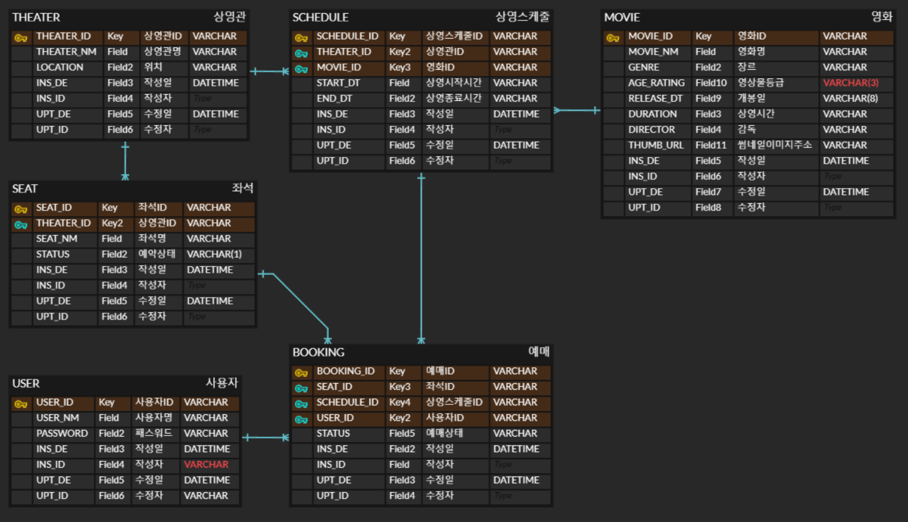

## [본 과정] 이커머스 핵심 프로세스 구현
[단기 스킬업 Redis 교육 과정](https://hh-skillup.oopy.io/) 을 통해 상품 조회 및 주문 과정을 구현하며 현업에서 발생하는 문제를 Redis의 핵심 기술을 통해 해결합니다.
> Indexing, Caching을 통한 성능 개선 / 단계별 락 구현을 통한 동시성 이슈 해결 (낙관적/비관적 락, 분산락 등)

# 항해 시네마 (Hanghea Cinema)
"항해 시네마"는 영화관 웹 애플리케이션 프로젝트입니다. 이 애플리케이션은 영화 정보 제공, 상영 스케줄 관리, 좌석 예매와 같은 기능을 제공합니다.

- 프로젝트 기간 : 2025.01.04 ~ 2025.02.09 (에정)
- 기술스택 : SpringBoot, Java, Gradle, IntelliJ, Docker, MySQL, Windows

# [ERD]
항해 시네마의 데이터 모델 청사진입니다.

|테이블명| 기능       | 설명                                                                              |
|-------|----------|---------------------------------------------------------------------------------|
|MOVIE| 영화 정보    | 영화의 기본 정보 (제목, 장르, 등급, 개봉일 등)을 관리                                               |
|THEATER| 상영관 정보   | 상영이 이루어지는 상영관의 정보 관리                               |
|SEAT| 좌석 정보    | 상영관 내 좌석 정보 관리 (* 좌석은 상영관에 상관없이 A~E열까지 5개의 열이 있으며, 각 열은 5개의 좌석이 있다. (총 25석) |
|SCHEDULE| 상영스케줄 정보 | 영화 상영 일정 및 시간을 관리                                                               |
|USER| 사용자 정보   | 서비스 이용자의 정보 관리                                                                  |
|BOOKING| 예매 정보    | 사용자의 영화 예매 기록을 관리                                                               |

- 각 테이블에는 작성일(INS_DE)과 수정일(UPT_DE)을 추가하여 데이터 변경 이력을 추적한다.
- 주요 칼럼에는 NOT NULL 제약 조건을 적용해 필수 데이터를 보장하도록 한다.

### 테이블 관계
|관계|설명|
|---|---|
|THEATER ↔ SEAT|하나의 상영관에 여러 좌석이 존재 (1:N 관계)|
|MOVIE ↔ SCHEDULE|하나의 영화가 여러 상영 스케줄을 가질 수 있음 (1:N 관계)|
|THEATER ↔ SCHEDULE|하나의 상영관에서 여러 상영 스케줄을 가질 수 있음 (1:N 관계)|
|USER ↔ BOOKING|한 명의 사용자가 여러 예매를 가질 수 있음 (1:N 관계)|
|SEAT ↔ BOOKING|하나의 좌석이 여러 예매에 참조될 수 있음 (1:N 관계)|
|SCHEDULE ↔ BOOKING|하나의 상영 스케줄이 여러 예매와 연결될 수 있음 (1:N 관계)|

### 사용 예시
- 사용자는 영화와 상영관, 스케줄을 확인한 후 좌석을 선택하고 예매를 진행할 수 있다.
- 영화가 업데이트되거나 상영관이 추가되더라도 데이터베이스 구조는 유연하게 확장 가능하다.

### 개선 및 확장 아이디어

- 영화 리뷰 및 평점 테이블 (별도 모듈 구성?)
- 할인 쿠폰 및 프로모션 테이블 (본 교육과정 이후(?) 결제 모듈 구성 후, 고려해볼 사항)

